# Architecture diagrams — Bindlace

This page complements [SYSTEM_DESIGN.md](SYSTEM_DESIGN.md) with **visual maps** of the system: context, packages, internal components, CLI flows, runtime sequences, and **where languages (Node, Java, …) sit**. Diagrams use [Mermaid](https://mermaid.js.org/) and render on GitHub, GitLab, and many Markdown viewers.

**Last updated:** 2026-04-19

---

## 1. System context (C4-style)

Who interacts with what at the highest level: portable specs, the Node runner, and the environment under test.

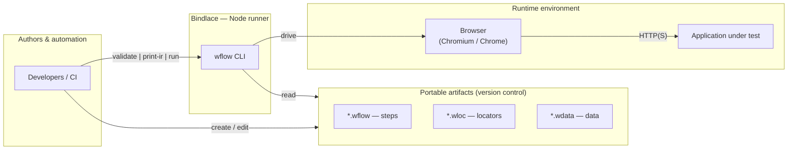

---

## 2. Repository and packages

What lives in the repo and how the main **npm** packages relate. The `autonomous-dev/` folder is an experiment and is **not** part of the Bindlace contract (see root [README.md](../README.md)).

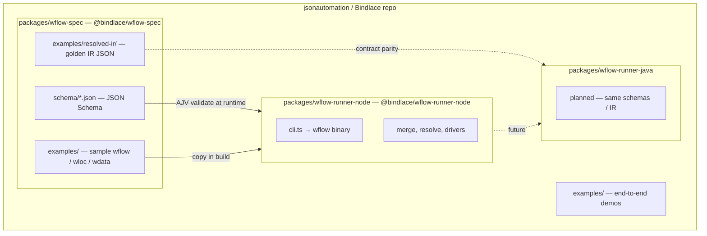

---

## 3. Logical architecture (artifacts → IR → drivers)

The pipeline described in [SYSTEM_DESIGN.md §2–4](SYSTEM_DESIGN.md): one **resolved IR** feeds either driver without changing user files.

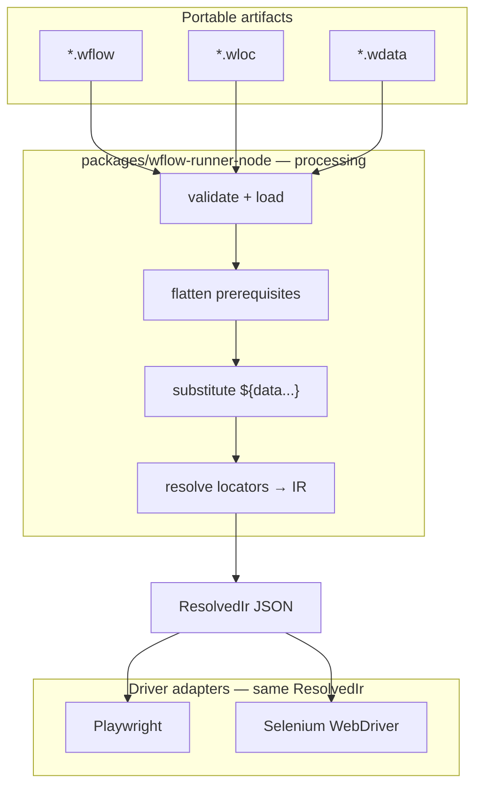

---

## 4. Component diagram — `wflow-runner-node` modules

Internal TypeScript modules and their main relationships. **Driver code** stays at the bottom so shared logic never imports Playwright or Selenium types (see `.cursor/rules/runner-node.mdc`).

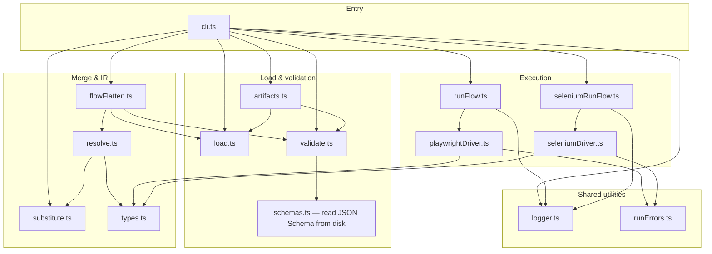

---

## 5. Pipeline stages (detailed)

Step-by-step mapping to source files (see [SYSTEM_DESIGN.md §4](SYSTEM_DESIGN.md)).

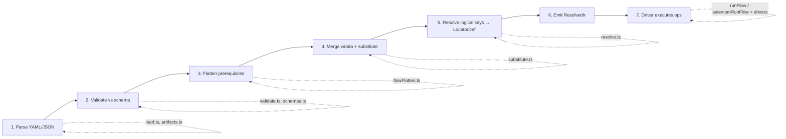

---

## 6. CLI command flows

What each subcommand does: **validate** can check schema only; **print-ir** and **run** both build the IR; only **run** opens a browser.

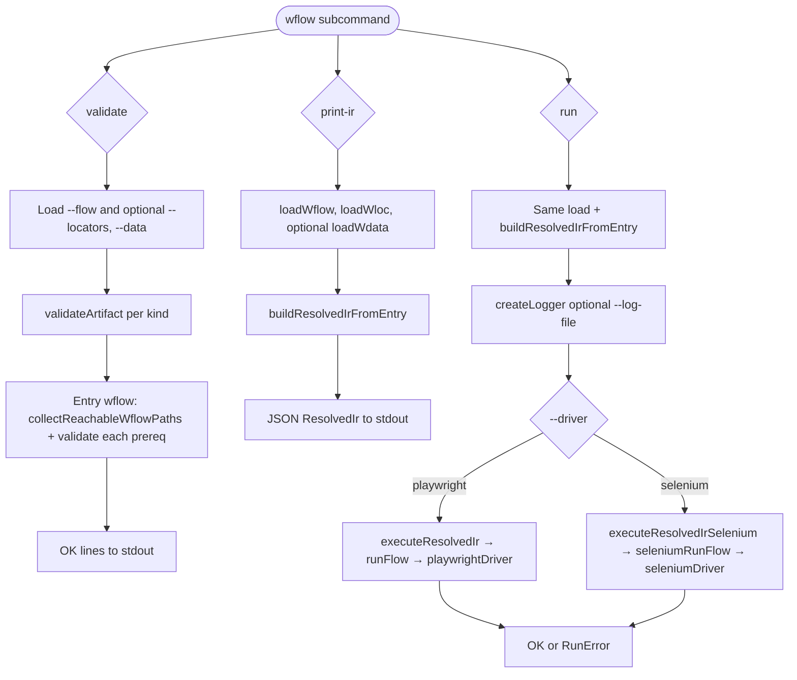

---

## 7. Sequence — `wflow run` (Playwright path)

Typical message flow from CLI to browser. Selenium follows the same **IR** boundary; only the execution block differs.

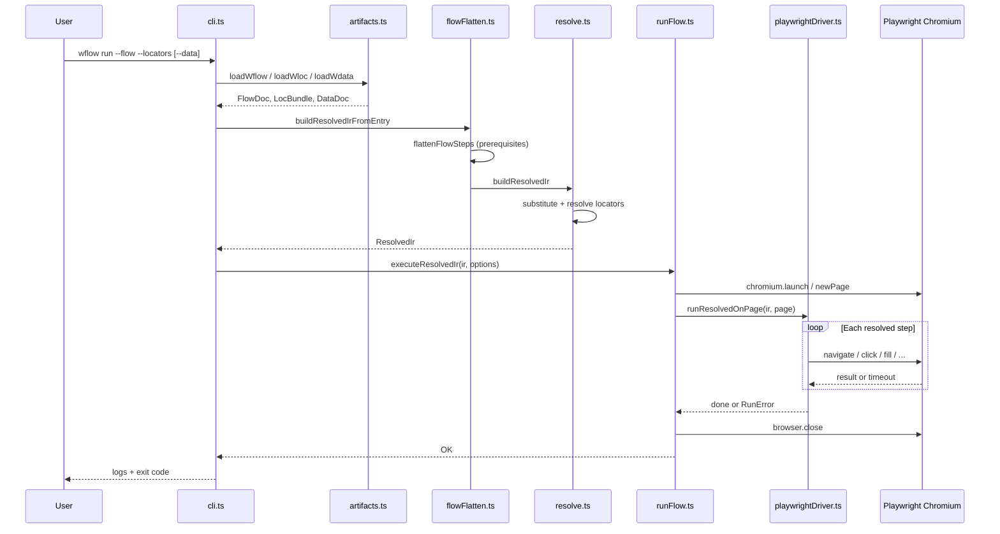

---

## 8. Prerequisite flattening

How nested `prerequisites` become a single linear `steps` array before resolution (cycles are rejected).

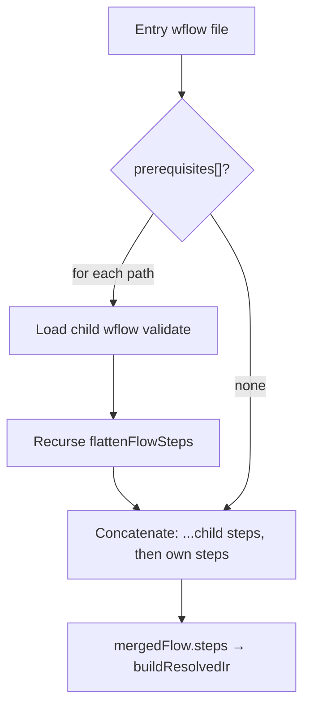

---

## 9. Where programming languages fit (authoring vs runtime)

**Authoring** is **not** tied to Java, Python, Node, or .NET: flows are **JSON/YAML** only. **Runtimes** are separate: today the full **validate → merge → resolve → drive browser** path is implemented in **Node/TypeScript**; a **JVM** runner is **planned**; other languages are **not** in this repo but could execute the same **ResolvedIr JSON** if someone implements a runner (see [SYSTEM_DESIGN.md §4–5](SYSTEM_DESIGN.md), [FEATURES.md](FEATURES.md) F7/F12).

### 9a. Three layers: specs → contract → browser drivers

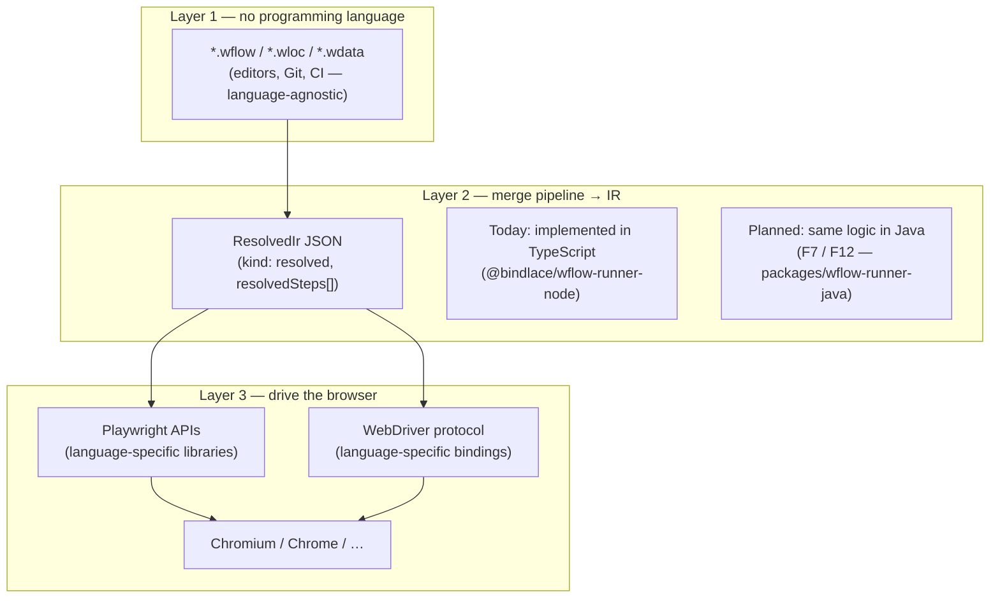

Layer 2 is **where “which language” matters for the shipped tooling**: only **Node** implements the full pipeline today. Layer 3 shows that **Playwright** and **Selenium** each have **bindings** in several languages (Node, Java, Python, .NET, …); Bindlace picks one binding **per runner** (e.g. Node uses `playwright` and `selenium-webdriver` npm packages).

### 9b. Who produces IR vs who executes IR (Node, Java, Python, .NET, …)

Solid arrows = **implemented** in this repo. Dashed = **planned** (Java) or **hypothetical** (you would supply a runner).

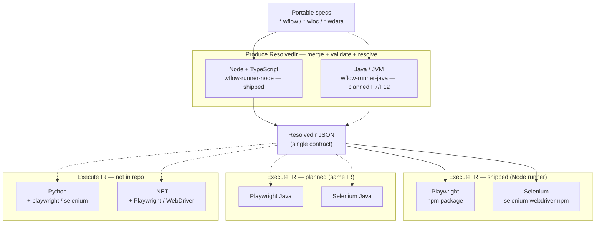

**Important:** `--driver selenium` today means **Selenium’s Node.js binding** talks to ChromeDriver, **not** “Node launches a Java Selenium server.” **Python / .NET / Go** are not part of Bindlace yet; they only appear here as **places you could implement an IR executor** using each ecosystem’s Playwright or WebDriver libraries.

### 9c. Bridge pattern: any language can execute **pre-built IR**

If merge/resolve stays on Node, another stack only needs to **execute** JSON (useful until a full JVM/Python runner exists):

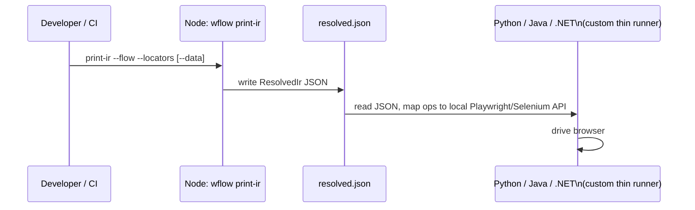

---

## 10. Resolved IR and extension points

Mental model for contributors: new **author steps** map to **IR ops**; new **drivers** consume the same `ResolvedIr`.

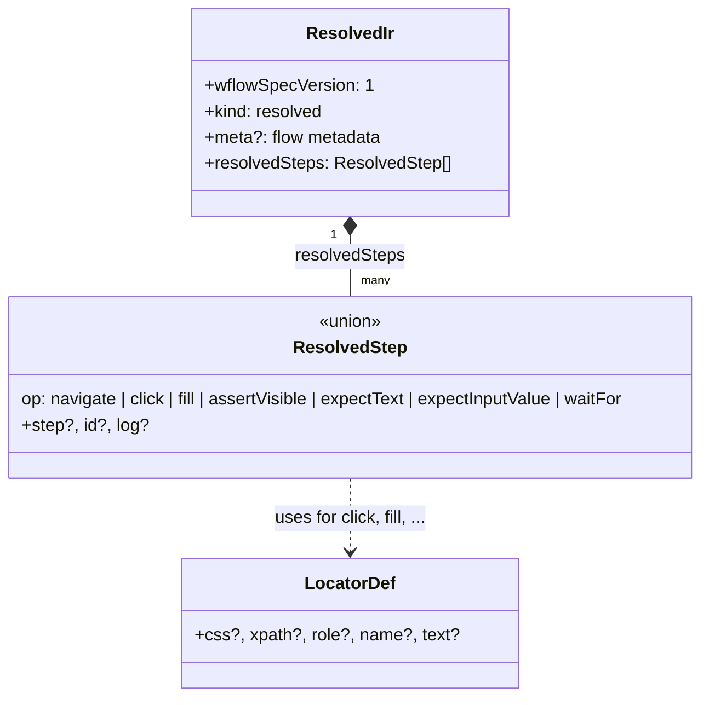

---

## 11. Document maintenance

When you change the pipeline, CLI, module boundaries, or IR shape:

- Update [SYSTEM_DESIGN.md](SYSTEM_DESIGN.md) and this file.
- Follow [docs-sync](../.cursor/rules/docs-sync.mdc): keep [FEATURES.md](FEATURES.md) and [IMPLEMENTATION.md](IMPLEMENTATION.md) in sync when behavior changes.

To **export diagrams** as PNG/SVG for slides or docs, use [Mermaid Live Editor](https://mermaid.live/), the Mermaid CLI, or your IDE’s Mermaid preview.
