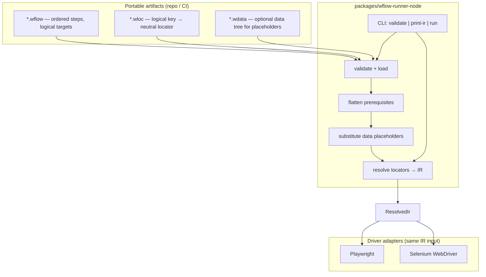

# System design — Bindlace

**Bindlace** is a **language- and driver-neutral** automation layer: portable **`wflow` / `wloc` / `wdata`** artifacts, a **resolved IR**, and pluggable **browser adapters** (Playwright and Selenium on Node today; other runtimes can consume the same IR).

**Scope:** Web UI flows (v1), neutral locators, merge pipeline, and Node execution.  
**Audience:** Contributors and runtime implementers who need the big picture without re-reading every module.  
**Diagrams:** For additional Mermaid views (context, components, CLI flows, sequences), see [DIAGRAMS.md](DIAGRAMS.md).

---

## 1. Goals

- **Language- and framework-agnostic authoring:** Users maintain **JSON or YAML** only for flows, locators, and data—not a single browser API or programming language.
- **Swappable execution:** Changing **Node ↔ Java** or **Playwright ↔ Selenium** should not require editing flow, locator, or data files—only which **runner** and **driver adapter** is executed.
- **Single contract between compilers and runtimes:** A **resolved IR** (JSON-shaped object) is the boundary; any compliant runner can execute it.

Non-goals are tracked in [FEATURES.md](FEATURES.md) (e.g. iframes/shadow DOM until specified).

---

## 2. Logical architecture



---

## 3. Artifact families

| Extension / `kind` | Purpose |
|--------------------|--------|
| `*.wflow` / `wflow` | Ordered **steps** referencing **logical** target keys (e.g. `loginButton`), not raw selectors in the common case. Optional **`prerequisites`**: paths to other `*.wflow` files (relative to the **current file’s directory**), merged recursively with **cycle detection**. |
| `*.wloc` / `wloc` | Maps each logical key to a **neutral** locator: `css`, `xpath`, `role`+`name`, `text`, etc. (subset enforced by JSON Schema). |
| `*.wdata` / `wdata` | Optional key/value tree; used to resolve **`${data.<dot.path>}`** placeholders in merged steps (and optional root `log` strings). |

Every artifact declares **`wflowSpecVersion: 1`**. Breaking changes bump this integer and are documented in [FEATURES.md](FEATURES.md).

**Runtime-only settings** (headless, default timeouts, browser channel) belong in **CLI flags** or a future runtime config file—not inside portable flow files.

---

## 4. Execution pipeline (Node)

Stages map roughly to modules under `packages/wflow-runner-node/src/`:

1. **Parse and validate** — Load YAML/JSON; validate against JSON Schemas in `packages/wflow-spec/schema/` (`validate.ts`, `load.ts`, `artifacts.ts`).
2. **Flatten prerequisites (wflow only)** — `flowFlatten.ts`: load each referenced `*.wflow`, recurse, concatenate `[...prerequisiteSteps, ...entry.steps]`; cycles **fail**.
3. **Merge data** — Apply `wdata` and substitute `${data...}` in the combined step array (`substitute.ts`, `resolve.ts`).
4. **Resolve locators** — Replace logical targets with concrete `LocatorDef` from `wloc`; expand composite author steps (e.g. `navigate` + inline `assertVisible`) into multiple IR ops (`resolve.ts`).
5. **Driver adapter** — Interpret `ResolvedIr.resolvedSteps` with Playwright or Selenium (`playwrightDriver.ts`, `seleniumDriver.ts`, orchestration in `runFlow.ts`, `seleniumRunFlow.ts`).

**Debug without a browser:** `wflow print-ir` runs steps 1–4 and prints JSON.

---

## 5. Resolved IR contract

The in-memory / printed shape is defined in TypeScript as `ResolvedIr` and `ResolvedStep` in `packages/wflow-runner-node/src/types.ts`:

- **`kind: "resolved"`**, **`wflowSpecVersion: 1`**
- **`meta`** — optional flow metadata
- **`resolvedSteps`** — ordered list of ops, each with optional author annotations (`step`, `id`, `log`)

Supported **`op`** values (v1): `navigate`, `click`, `fill`, `assertVisible`, `expectText`, `expectInputValue`, `waitFor`.

**Cross-runtime rule:** Java or other language runners should consume the **same** JSON IR shape (golden fixtures under `packages/wflow-spec/examples/` / `resolved-ir/` are the parity target; formal JSON Schema for IR is still optional per [FEATURES.md](FEATURES.md)).

---

## 6. Driver adapters (Node)

| Adapter | Entry | Responsibility |
|---------|--------|----------------|
| **Playwright** | `runFlow.ts` → `playwrightDriver.ts` | Launch Chromium (configurable via existing CLI); map each IR op to Playwright APIs (`getByRole`, `locator`, etc.). |
| **Selenium** | `seleniumRunFlow.ts` → `seleniumDriver.ts` | Launch Chrome via `selenium-webdriver`; map each IR op to WebDriver primitives. Neutral locators are translated to `By` (CSS/XPath or XPath approximations for `role`/`text`). |

**CLI selection:** `wflow run ... --driver playwright` (default) or `--driver selenium`. The same `--flow`, `--locators`, and optional `--data` apply to both.

**Semantic note:** Playwright’s accessibility locators and Selenium’s XPath fallbacks for `role`/`text` may **diverge** on some pages; flows that must behave identically on every driver should prefer **`css` or `xpath`** in `wloc`.

---

## 7. Repository layout (relevant packages)

```
packages/
  wflow-spec/          # JSON Schemas, example *.wflow / *.wloc / *.wdata, IR examples
  wflow-runner-node/   # CLI, merge/resolve, Playwright + Selenium adapters
```

Root [CLAUDE.md](../CLAUDE.md) summarizes day-to-day conventions; [IMPLEMENTATION.md](IMPLEMENTATION.md) tracks task-level progress.

---

## 8. Extension points

- **New step types:** Extend JSON Schema for `wflow`, extend `resolve.ts` to emit new `ResolvedStep` variants, implement handling in **both** driver modules (or explicitly document driver support matrix).
- **New driver:** New module that accepts `ResolvedIr` + shared logging/error types (`runErrors.ts`, `logger.ts`); wire through CLI with a new `--driver` value.
- **Java runner:** Same schemas + same IR JSON; mirror merge/resolve logic and implement one driver (Playwright Java or Selenium) — see [FEATURES.md](FEATURES.md) F7 / F12.

---

## 9. Observability

- **Runner logs:** Step start, optional author `log`, done duration, failure message; optional **`--log-file`** mirrors stdout.
- **Failures:** `RunError` carries step index and failed op for stable reporting; optional screenshot path on failure (both drivers).

---

## 10. Document maintenance

When the pipeline, IR shape, or CLI surface changes in a user-visible way, update this file, [DIAGRAMS.md](DIAGRAMS.md), and [FEATURES.md](FEATURES.md) as appropriate. **Last updated:** 2026-04-19 (link to DIAGRAMS.md).
